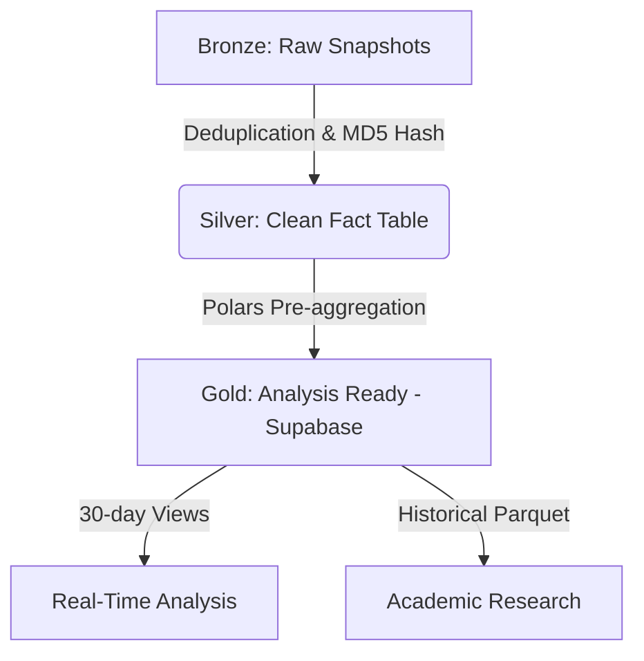

# Technical Chronicle: Anatomy of a Research Infrastructure

This document provides a technical narrative of the project's evolution, from a real-time monitor to a high-performance data infrastructure for academic research.

## 📜 Table of Contents
1. [The Origin: The IP Wall](#1-the-origin-the-ip-wall)
2. [The Pivot: Local-First and Async](#2-the-pivot-local-first-and-async)
3. [Medallion Architecture: From Chaos to Gold](#3-medallion-architecture-from-chaos-to-gold)
4. [Data Transparency and EDA](#4-data-transparency-and-eda)
5. [Customer Estimation Methodology](#5-customer-estimation-methodology)
6. [Frontend Integration Spec](#6-frontend-integration-spec)

---

## 1. The Legacy: Real-Time Architecture (2017-2024)

This section documents the original continuous monitoring architecture, designed to operate 24/7 before the pivot towards historical research. Although much of this code now lives in [`scripts/legacy/`](https://github.com/simonkey1/SEC/tree/master/scripts/legacy), its design patterns were fundamental to understanding the nature of the data.

### 1.1 High Availability & Resilience Design
The goal was to maintain a constant "heartbeat" of the electrical system. To achieve this in a hostile environment (IP blocks, timeouts), we implemented robust stability patterns.

#### 🛡️ Circuit Breaker Pattern
To avoid saturating the origin server and prevent brute-force IP bans, we implemented a **Circuit Breaker** (`core/circuit_breaker.py`).
- **Logic**: If the scraper detected 5 consecutive failures (HTTP 500/503 or DOM changes), the circuit would "open".
- **Effect**: The system entered a 30-minute "Cooldown" mode, rejecting any new scraping attempts until the origin stabilized.
- **Evidence**: Unit tests in `tests/unit/test_circuit_breaker.py` validate this state transition (CLOSED -> OPEN -> HALF-OPEN).

### 1.2 Monitoring: Fail-Fast & Logs
In an unattended system, silence is the worst error. We implemented a **Fail-Fast** strategy:
- **Structured Logs**: Each pipeline step emitted logs with context (Timestamp, Stage, ErrorCode).
- **Change Detection**: If the SEC HTML structure changed (common occurrence), the parser failed immediately instead of ingesting corrupt data (`Fast-Fail`).
- **Health Checks**: Auxiliary scripts (`core/health_check.py`) periodically verified the process was alive and writing to the database.

### 1.3 Data Management: Infinite Storage
With a limited cloud storage budget, we couldn't keep everything forever.
- **Sliding Window**: The database was designed to keep only 30 days of "hot data" for the real-time dashboard.
- **Automatic Cleanup**: The `scripts/legacy/cleanup_old_data.py` script ran chronologically to:
    1.  Archive old data in compressed format (Cold Storage).
    2.  Delete raw records from the operational DB to keep indices light.

### 1.4 Hybrid Testing Strategy
We maintained a strict separation of concerns in testing:
- **Unit (`tests/unit/`)**: Isolated validation of logical components (e.g., Does the Circuit Breaker open correctly?).
- **Integration (`tests/integration/`)**: Validation of the full flow, including database connection and actual file cleanup execution.

> [!NOTE]
> For implementation details, see scripts in [`scripts/legacy/`](https://github.com/simonkey1/SEC/tree/master/scripts/legacy) or check the main [README.md](https://github.com/simonkey1/SEC/blob/master/README.md).

---

## 2. The Pivot: Local-First and Async
The need for historical data for long-term academic research (2017-2025) forced a radical redesign. We abandoned the "continuous cloud ETL" idea for a **Historical Sync Local** approach.

### Advantages of the Change
- **Block Bypass**: Scraping from residential local connections proved more resilient than from datacenters (cloud IPs are often flagged).
- **Simplification**: Instead of maintaining a "live" 24/7 database with high costs, we opted to process heavy monthly files in bursts.
- **Speed**: We implemented an asynchronous engine in Python (`aiohttp` + `asyncio`) that reduced processing time from hours to minutes.

---

## 3. Medallion Architecture: From Chaos to Gold
To handle ~6.2 million records, we implemented a **Medallion Architecture** adapted for free infinite storage.



- **Bronze Layer (Local - Raw)**: We save the entire raw history in the cloud (low-cost/free storage). **Volume: ~3.7 GBs** of temporary files (json snapshots).
- **Silver Layer (Local - Clean)**: Local PostgreSQL where the deduplicated `fact_interrupciones` lives.
- **Gold Layer (Cloud - Business)**: Optimized views and pre-calculated JSONs uploaded to Supabase to feed the frontend. This gives us "infinite storage" in terms of analysis, as we only keep what is strictly necessary for active visualization.

### 3.1 The Sync Bridge
The script [`scripts/etl/sync_dashboard_data.py`](https://github.com/simonkey1/SEC/blob/master/scripts/etl/sync_dashboard_data.py) is responsible for materializing the "Gold Layer". Its function is to decouple the weight of Big Data (Parquet of millions of rows) from the agility required by the Frontend (lightweight JSONs).

#### Transformation Logic
1.  **Load**: Reads `golden_interrupciones.parquet` using **Polars** (for speed).
2.  **Aggregation**: Generates specific payloads for each visualization. For example, for the *Market Map*, it groups by region/company and calculates the instability index.
3.  **Upsert**: Connects to Supabase via API and updates the `dashboard_stats` table using the dataset ID (e.g., `market_map`, `eda_quality_stats`).

> **Why not connect Frontend directly to DB?**
> To protect the analysis database from massive concurrent queries. By pre-calculating and serving static JSONs, the dashboard loads in milliseconds without stressing the main data engine.

---

## 4. Data Transparency and EDA
The foundation of our research is transparency. Here we present a brief Exploratory Data Analysis (EDA) of our database.

### 4.1 Outage Data Quality
The visualization shows a **total absence of null values** in the final database. This is not accidental, but the result of a **Defensive Ingestion** strategy in the ETL layer `AsyncPostgreSQLRepository`.

#### Imputation Rules (Hard Rules)
To avoid corrupting the fact table with dirty data, we apply the following transformations *before* insertion. In the current cut (Total: **731,666 events**), the incidence of these rules was:

1.  **Affected Customers**: If the field is empty or null, it is imputed with `0`.
    *   *Real Incidence*: **0 cases (0.00%)**. The data source has proven consistent in this critical field.
2.  **Geography/Company**: If the Commune or Company ID does not resolve against cached dimensions, it is assigned the ID for `"UNKNOWN"`.
    *   *Real Incidence*: **0 cases (0.00%)**. All reported communes and companies mapped successfully to our master dictionaries.
3.  **Dates**: If `start_date` is not parsable, `timestamp_server` is used as fallback.

This strict pre-processing explains the dataset cleanliness: **imputation rules acted as latent "Guardrails"**, ensuring any future anomaly is captured without stopping the pipeline.

> [!NOTE]
> **Source Quality Hypothesis**: Perfect consistency (0 referential integrity errors) indicates the SEC public endpoint **does not expose raw sensor data**, but serves a view already processed and validated by their internal systems. We effectively valid consume "Pre-Silver" data.

### 4.2 Project Cross-Reference (SEIA)
To validate if investment aids reliability, we crossed outage data with the SEIA project database related to electricity.


*Figure 2: Distribution of electrical investment projects analyzed for the study.*

> [!NOTE]
> **Mining vs Energy**: Although the Antofagasta Region is dominated by mining, projects counted here are exclusively from the **Energy Sector** (Transmission Lines, Substations, BESS). It is common for mining companies (e.g., *Minera Spence*) to act as owners of these projects to supply their operations, but technically they constitute electrical infrastructure.

---

## 5. Customer Estimation Methodology
Determining the severity of an outage requires two figures: the numerator (affected) and the denominator (total customers). We use distinct SEC endpoints for each:

### A. Denominator: Customer Universe (`GetClientesRegional`)
To calculate normalized metrics (like users affected per 1000 customers), we need the total meters per region.
- **Source**: Endpoint `/GetClientesRegional`.
- **Frequency**: Monthly scrape (see `scripts/scrapers/scrape_clientes_region.py`).
- **Use**: Defines the "base population" of the region in that month.

### B. Numerador: Instant Affectation (`GetPorFecha`)
This is "live" data. It comes from the `Clients` field within the JSON payload of each interruption.
- **Validation**: We compare this value against the regional total. If an event reports more affected than the region total (anomaly detected in &lt; 0.01% of cases), we *cap* it at the regional total.

### C. The "Net Affectation" Algorithm
A power cut is not static; it evolves.
> *Example: At 14:00 there are 500 affected. At 14:10 there are 1000. At 14:20 they drop to 200.*

Our "Affected Customers" metric for the event (identified by `hash_id`) is defined as the **High-Water Mark** registered during the event's life. This prevents underestimating the incident magnitude if the scraper captures the event just as it is resolving.

---

> [!TIP]
> All code for this infrastructure is available in [`scripts/etl/`](https://github.com/simonkey1/SEC/tree/master/scripts/etl) and [`scripts/analysis/`](https://github.com/simonkey1/SEC/tree/master/scripts/analysis).

---

## 6. Frontend Integration Spec
This annex details the data structure available in Supabase (`dashboard_stats`) to replicate the visualizations of this Chronicle.

### 6.1 Data Transparency (Data Quality)
**Payload ID**: `eda_quality_stats`
*Data for Figure 1: Records requiring imputation.*

```typescript
interface DataQualityStat {
  category: string;     // E.g.: "Affected = 0 (Imputed)"
  count: number;        // Absolute record count
  percentage: number;   // 0.0 to 1.0 (E.g.: 0.05 is 5%)
}
```
**Visualization Rules**:
- **Type**: Bar Chart.
- **Tooltip**: Show absolute and percentage (e.g., `0 (0.00%)`).
- **Context**: Explain that "0" is the ideal result.

### 6.2 Project Distribution (SEIA)
**Payload ID**: `eda_projects_dist`
*Data for Figure 2: Electrical investment projects by region.*

```typescript
interface ProjectDistributionItem {
  nombre_region: string; // E.g.: "ANTOFAGASTA", "METROPOLITANA"
  count: number;         // Project count
}
```
**Visualization Rules**:
- **Type**: Horizontal Bar Chart.
- **Order**: Descending by `count`.
- **Style**: Soft sequential palette (e.g., Blues/Slate).
