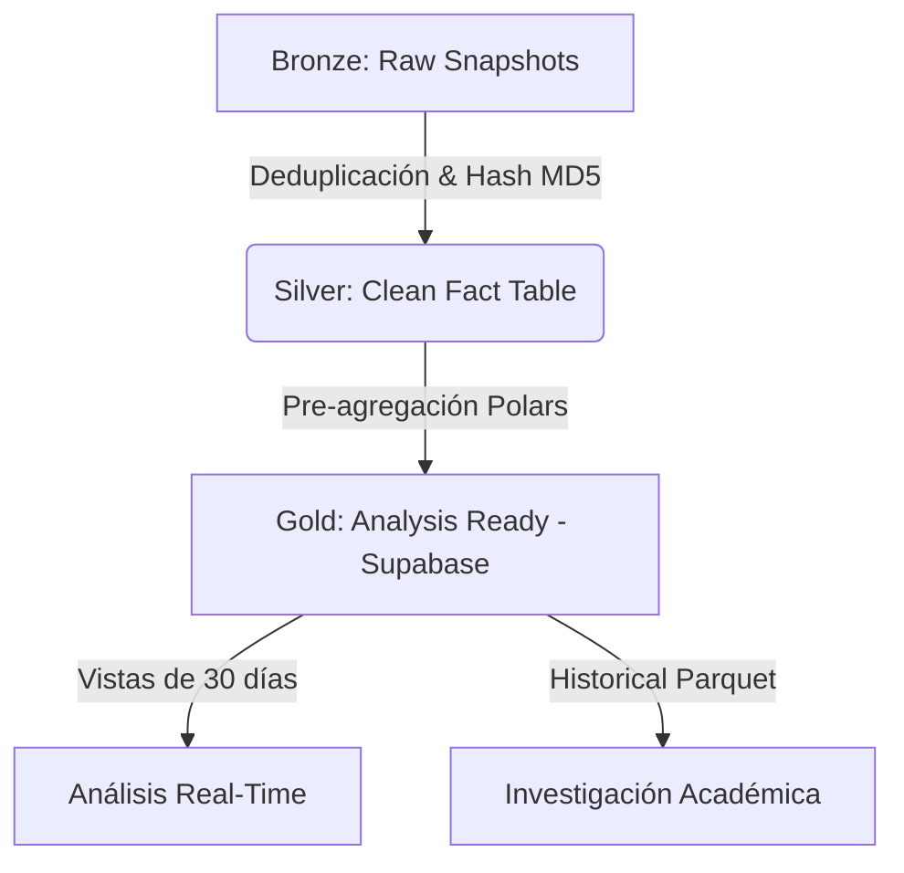

# Crónica Técnica: Anatomía de una Infraestructura de Investigación

Este documento narra la evolución técnica del proyecto, desde un monitor en tiempo real hasta una infraestructura de datos de alto rendimiento para investigación académica.

## 📜 Tabla de Contenidos
1. [El Origen: El Muro de las IP](#1-el-origen-el-muro-de-las-ip)
2. [El Pivote: Local-First y Asincronía](#2-el-pivote-local-first-y-asincronía)
3. [Arquitectura Medallón: Del Caos al Oro](#3-arquitectura-medallón-del-caos-al-oro)
4. [Transparencia de Datos y EDA](#4-transparencia-de-datos-y-eda)
5. [Metodología de Estimación de Clientes](#5-metodología-de-estimación-de-clientes)

---

## 1. El Legado: Arquitectura Real-Time (2017-2024)

Esta sección documenta la arquitectura original de monitoreo continuo, diseñada para operar 24/7 antes del pivote hacia la investigación histórica. Aunque gran parte de este código hoy vive en `scripts/legacy/`, sus patrones de diseño fueron fundamentales para entender la naturaleza del dato.

### 1.1 Diseño de Alta Disponibilidad & Resiliencia
El objetivo era mantener un "latido" constante del sistema eléctrico. Para lograrlo en un entorno hostil (bloqueos de IP, timeouts), implementamos patrones de estabilidad robustos.

#### 🛡️ Circuit Breaker Pattern
Para evitar la saturación del servidor origen y prevenir bloqueos de IP por fuerza bruta, implementamos un **Circuit Breaker** (`core/circuit_breaker.py`).
- **Lógica**: Si el scraper detectaba 5 fallos consecutivos (HTTP 500/503 o cambios en el DOM), el circuito se "abría".
- **Efecto**: El sistema entraba en modo de espera por 30 minutos ("Cooldown"), rechazando cualquier intento nuevo de scraping hasta que el origen se estabilizara.
- **Evidencia**: Los tests unitarios en `tests/unit/test_circuit_breaker.py` validan esta transición de estados (CLOSED -> OPEN -> HALF-OPEN).

### 1.2 Monitoreo: Fail-Fast & Logs
En un sistema desatendido, el silencio es el peor error. Implementamos una estrategia de **Fail-Fast**:
- **Logs Estructurados**: Cada paso del pipeline emitía logs con contexto (Timestamp, Stage, ErrorCode).
- **Detección de Cambios**: Si la estructura HTML de la SEC cambiaba (algo común), el parser fallaba inmediatamente en lugar de ingerir datos corruptos (`Fast-Fail`).
- **Health Checks**: Scripts auxiliares (`core/health_check.py`) verificaban periódicamente que el proceso estuviera vivo y escribiendo en la base de datos.

### 1.3 Gestión de Datos: Almacenamiento Infinito
Con un presupuesto de almacenamiento limitado en la nube, no podíamos guardar todo para siempre.
- **Ventana Deslizante**: La base de datos estaba diseñada para mantener solo 30 días de "datos calientes" para el dashboard en tiempo real.
- **Cleanup Automático**: El script `scripts/legacy/cleanup_old_data.py` se ejecutaba cronológicamente para:
    1.  Archivar datos antiguos en formato comprimido (Cold Storage).
    2.  Eliminar registros raw de la BD operacional para mantener los índices ligeros.

### 1.4 Estrategia de Testing Híbrida
Mantuvimos una estricta separación de responsabilidades en las pruebas:
- **Unitarias (`tests/unit/`)**: Validación aislada de componentes lógicos (ej. ¿El Circuit Breaker se abre correctamente?).
- **Integración (`tests/integration/`)**: Validacion del flujo completo, incluyendo la conexión a base de datos y la ejecución real del cleanup de archivos.

> [!NOTE]
> Para detalles de implementación, ver los scripts en `scripts/legacy/` o consultar el [README.md](../README.md) principal.

---

## 2. El Pivote: Local-First y Asincronía
La necesidad de datos históricos para una investigación académica de largo plazo (2017-2025) forzó un rediseño radical. Abandonamos la idea del "ETL continuo en la nube" por un enfoque **Historical Sync Local**.

### Ventajas del Cambio
- **Bypass de Bloqueos**: El scraping desde conexiones residenciales locales resultó ser más resiliente que desde datacenters.
- **Simplificación**: En lugar de mantener una base de datos "viva" 24/7 con alto costo, optamos por procesar archivos mensuales pesados en ráfagas.
- **Velocidad**: Implementamos un motor asíncrono en Python (`aiohttp` + `asyncio`) que redujo el tiempo de procesamiento de horas a minutos.

---

## 3. Arquitectura Medallón: Del Caos al Oro
Para manejar los ~6.2 millones de registros, implementamos una **Arquitectura Medallón** (Medallion Architecture) adaptada a almacenamiento infinito gratuito.

- **Bronze Layer**: Guardamos todo el historial raw en la nube (almacenamiento de bajo costo/gratuito).
- **Silver Layer**: PostgreSQL local donde vive la `fact_interrupciones` deduplicada.
- **Gold Layer**: Vistas optimizadas y JSONs pre-calculados que se suben a Supabase para alimentar el frontend. Esto nos da "almacenamiento infinito" en términos de análisis, ya que solo mantenemos lo justo y necesario para la visualización activa.

---

## 4. Transparencia de Datos y EDA
La base de nuestra investigación es la transparencia. Aquí presentamos un breve análisis exploratorio (EDA) de nuestra base de datos.

### 4.1 Calidad de los Datos de Interrupciones
La visualización (Figura 1) muestra una **ausencia total de valores nulos** en la base de datos final. Esto no es accidental, sino resultado de una estrategia de **Defensive Ingestion** en la capa ETL `AsyncPostgreSQLRepository`.

#### Reglas de Imputación (Hard Rules)
Para evitar corromper la tabla de hechos con datos sucios, aplicamos las siguientes transformaciones *antes* de la inserción. En el corte actual (Total: **731,666 eventos**), la incidencia de estas reglas fue:

1.  **Clientes Afectados**: Si el campo viene vacío o nulo, se imputa con `0`.
    *   *Incidencia Real*: **0 casos (0.00%)**. La fuente de datos ha demostrado ser consistente en este campo crítico.
2.  **Geografía/Empresa**: Si el ID de Comuna o Empresa no resuelve contra las dimensiones en caché, se asigna el ID correspondiente a `"DESCONOCIDO"`.
    *   *Incidencia Real*: **0 casos (0.00%)**. Todas las comunas y empresas reportadas mapearon exitosamente a nuestros diccionarios maestros.
3.  **Fechas**: Si la `fecha_inicio` no es parseable, se usa el `timestamp_server` como fallback.

Este pre-procesamiento estricto explica la limpieza del dataset: **las reglas de imputación actuaron como "Guardrails" latentes**, garantizando que cualquier anomalía futura sea capturada sin detener el pipeline.

> [!NOTE]
> **Hipótesis de Calidad en el Origen**: La consistencia perfecta (0 errores de integridad referencial) indica que el endpoint público de la SEC **no expone datos crudos de sensores**, sino que sirve una vista ya procesada y validada por sus propios sistemas internos. Consumimos, en efecto, un dato "Pre-Silver".

### 4.2 El Cruce con Proyectos (SEIA)
Para validar si la inversión ayuda a la fiabilidad, cruzamos los datos de cortes con la base de proyectos del SEIA relacionados con electricidad.

*Figura 2: Distribución de proyectos de inversión eléctrica analizados para el estudio.*

> [!NOTE]
> **Minería vs Energía**: Aunque la Región de Antofagasta está dominada por la minería, los proyectos aquí contabilizados son exclusivamente del **Sector Energía** (Líneas de Transmisión, Subestaciones, BESS). Es común que empresas mineras (ej: *Minera Spence*) actúen como titulares de estos proyectos para abastecer sus faenas, pero técnicamente constituyen infraestructura eléctrica.

---

## 5. Metodología de Estimación de Clientes
Determinar la gravedad de un corte requiere dos cifras: el numerador (afectados) y el denominador (total de clientes). Utilizamos endpoints distintos de la SEC para cada uno:

### A. Denominador: Universo de Clientes (`GetClientesRegional`)
Para calcular métricas normalizadas (como usuarios afectados por cada 1000 clientes), necesitamos el total de medidores por región.
- **Fuente**: Endpoint `/GetClientesRegional`.
- **Frecuencia**: Scrapeo mensual (ver `scripts/scrapers/scrape_clientes_region.py`).
- **Uso**: Define la "población base" de la región en ese mes.

### B. Numerador: Afectación Instantánea (`GetPorFecha`)
Es el dato "vivo". Proviene del campo `Clientes` dentro del payload JSON de cada interrupción.
- **Validación**: Comparamos este valor contra el total regional. Si un evento reporta más afectados que el total de la región (anomalía detectada en < 0.01% de casos), se hace *cap* al total regional.

### C. El Algoritmo de "Afectación Neta"
Un corte de luz no es estático; evoluciona. 
> *Ejemplo: A las 14:00 hay 500 afectados. A las 14:10 hay 1000. A las 14:20 bajan a 200.*

Nuestra métrica de "Clientes Afectados" para el evento (identificado por `hash_id`) se define como el **Máximo Histórico (High-Water Mark)** registrado durante la vida del evento. Esto previene subestimar la magnitud del incidente si el scraper captura el evento justo cuando se está resolviendo.

---

> [!TIP]
> Todo el código de esta infraestructura está disponible en `scripts/etl/` y `scripts/analysis/`.
